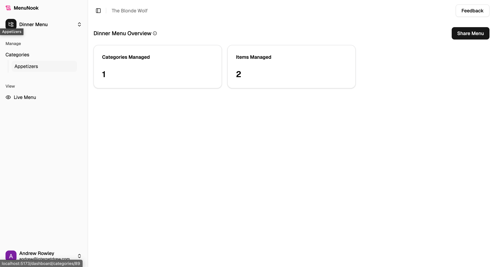
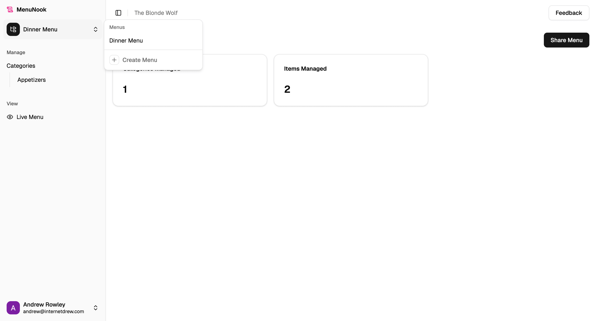
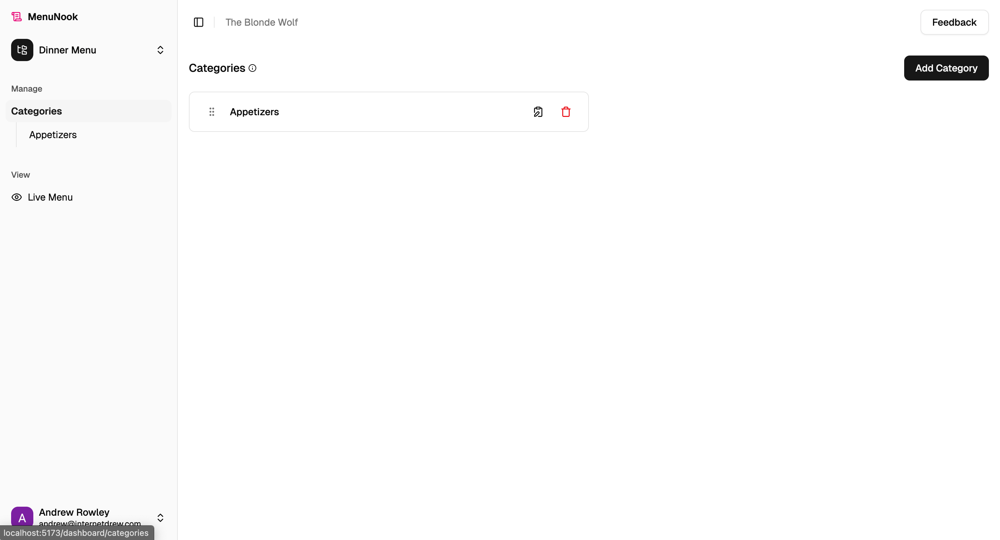
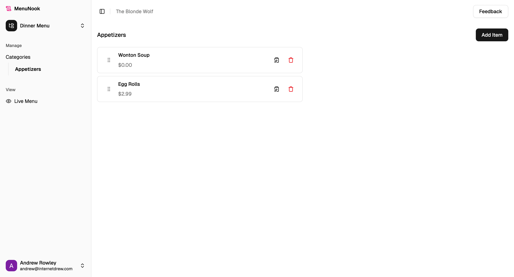
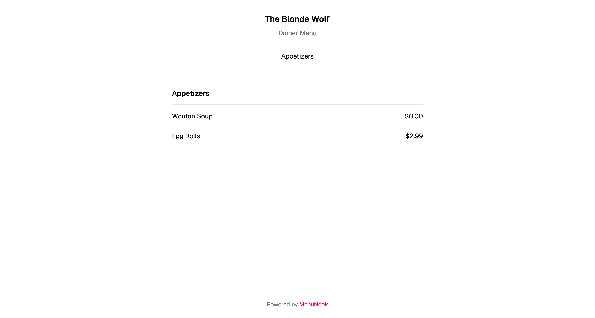
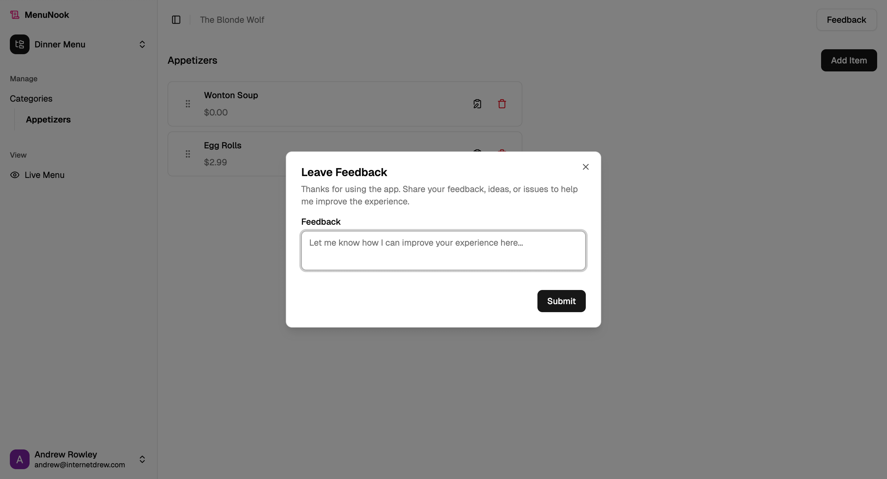
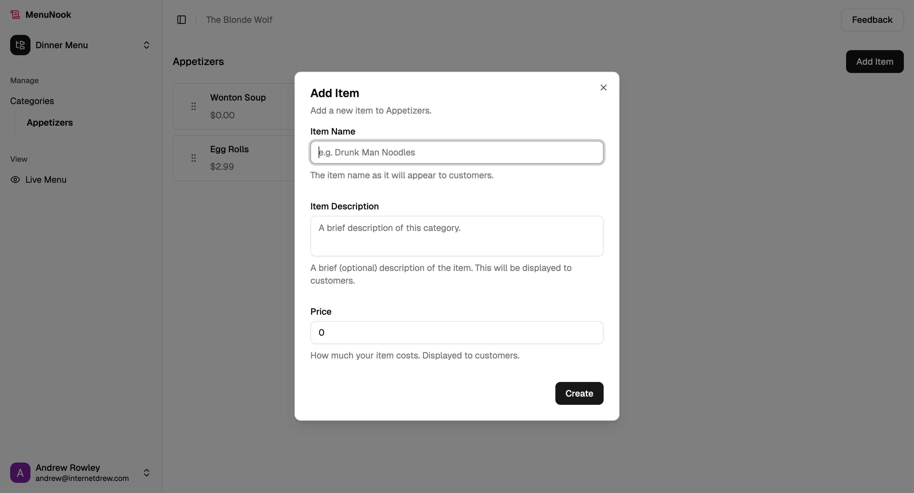
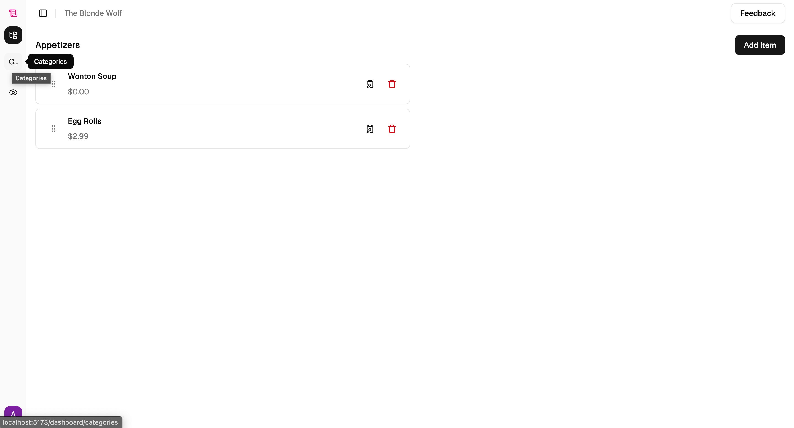
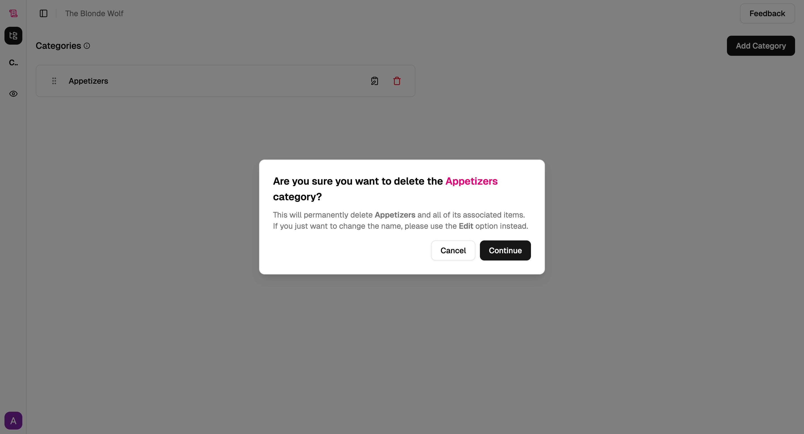

# MenuNook

A digital menu platform for chef-driven restaurants, letting guests explore dishes through photos, videos, and audio, bringing excitement to choosing what to order.

## Why MenuNook?

After doing some research on QR code menus, I found that many people actually hate them. But, BUT, many also shared that if they're going to visit a digital menu, they:

- Want it to actually be made for mobile, not a PDF they have to pinch and zoom around
- Want it to be a more engaging experience, not just a digital version of what might already be on the table or on their website

So I've decided to build a platform that allows chef-driven restaurants — the types that already have photo and video they use on social media and know the value of that experience — to bring a multimedia experience to their menus.

## Features

- Add beautiful photos, engaging video, and nuanced audio to every item on your menu.
- Build multiple menus per business, organized by categories with names, blurbs, and optional images.
- Add items in seconds with names, prices, descriptions, and photos when you have them.
- Each menu auto-generates a shareable link and printable QR.
- Customer view is responsive and distraction-free.
- Easily manage your menus from a phone or laptop and update instantly for customers.

## Screenshots

## Tech Stack

- Frontend: Vite + React 19 with TypeScript, React Router 7, shadcn/ui (Radix), Tailwind CSS, and dnd-kit for drag-and-drop ordering.
- Data layer: tRPC (client + server) paired with TanStack Query for caching and mutations.
- Backend: Express with tRPC handlers, Supabase for auth/database/storage, and Stripe for billing.
- Testing: Vitest with Testing Library (React, DOM, user-event), jsdom test environment, and MSW for API mocking.
- Tooling: ESLint, Prettier, tsx, nodemon, concurrently, and Tailwind merge utilities.
