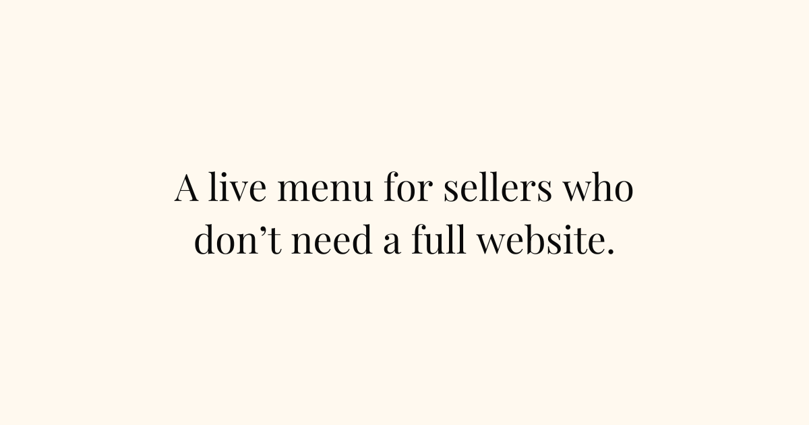

# MenuNook

A digital menu platform for chef-driven restaurants, letting guests explore dishes through photos, videos, and audio, bringing excitement to choosing what to order.

## Why MenuNook?

After doing some research on QR code menus, I found that many people actually hate them. But, BUT, many also shared that if they're going to visit a digital menu, they:

- Want it to actually be made for mobile, not a PDF they have to pinch and zoom around
- Want it to be a more engaging experience, not just a digital version of what might already be on the table or on their website

So I've decided to build a platform that allows chef-driven restaurants — the types that already have photo and video they use on social media and know the value of that experience — to bring a multimedia experience to their menus.

## The Challenge

Providing media in this setting and having a stellar experience is tough. The guests might be in a place with horrible reception. Most apps I see in existence don't seem to manage this well (if they care at all).

So the challenge I'm taking on here is high-performance even in subpar network conditions for a very excited (read: hungry) (and likely impatient) user. Performance isn't a nice to have here. It's differentiation.

A few things I'm considering as I build:

- Using modern image formats, compression, and responsive sizes to avoid loading massive images on small devices (something of a concern because if the restraurants have great photos, they'll likely have the largest file sizes for best quality)
- Streaming formats for videos (HLS vs mp4)
- Restrictions on videos. A short video is all you need to make a huge difference. Balancing the tradeoffs here is still cloudy but I will get there
- Blurred placeholders (photo) and immediate posters (video) for a more engaging experience even in slow-loading scenarios
- For audio, I need to explore a little more on file formats there. Needs to be lightweight and clear, but not overly done. Wondering if this might be a pleasant experience for those who have vision issues. While a screen-reader might do well for the text, voices and inflection could really elevate the experience for those users.
- CACHE CACHE CACHE. This will likely rely heavily on caching to avoid refetches.
- Progressive enhancement for SPEEEEED. The menu itself should be available instantly. That's already a big win. Handling media should be based on the user movement, not loading everything that might not ever get touched.
- Gracefully failing. Particularly worried about this when it comes to video. Exploring options when I get here.
- Offline caching. I've never done this before, but it seems the [Service Workers API](https://developer.mozilla.org/en-US/docs/Web/API/Service_Worker_API) might be a massive help here. Shout out to web technologies!

In all, the overall experience I want to build treats:

- Text as primary
- Media as an enhancement
- Everything as on-demand

## Features

- Add beautiful photos, engaging video, and nuanced audio to every item on your menu.
- Build multiple menus per business, organized by categories with names, blurbs, and optional images.
- Add items in seconds with names, prices, descriptions, and photos when you have them.
- Each menu auto-generates a shareable link and printable QR.
- Customer view is responsive and distraction-free.
- Easily manage your menus from a phone or laptop and update instantly for customers.

## Screenshots

## Tech Stack

- Frontend: Vite + React 19 with TypeScript, React Router 7, shadcn/ui (Radix), Tailwind CSS, and dnd-kit for drag-and-drop ordering.
- Data layer: tRPC (client + server) paired with TanStack Query for caching and mutations.
- Backend: Express with tRPC handlers, Supabase for auth/database/storage, and Stripe for billing.
- Testing: Vitest with Testing Library (React, DOM, user-event), jsdom test environment, and MSW for API mocking.
- Tooling: ESLint, Prettier, tsx, nodemon, concurrently, and Tailwind merge utilities.
